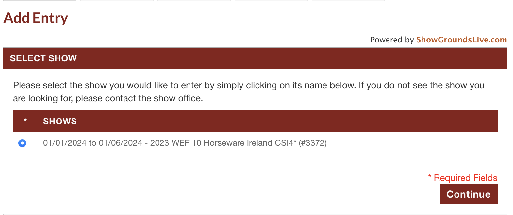
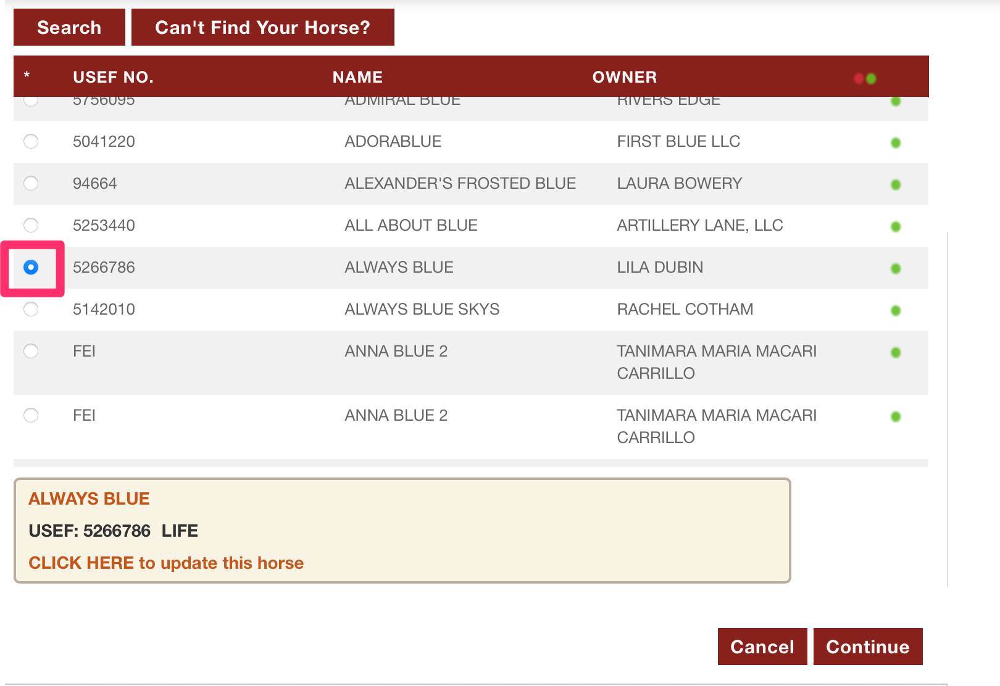
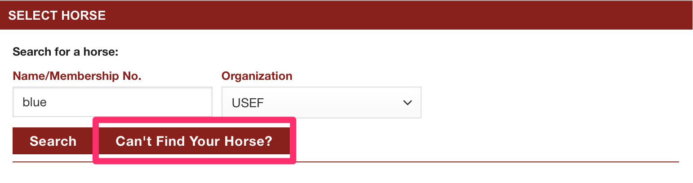

# 📃 How to Create an Online Entry

[Click here for a screencast example of how to put in your Entries.](http://docs.showgroundsonline.com/wp-content/uploads/2022/03/Entry-West-Palm.mov)

Once you have created a login with ShowGroundsLive, you can begin the process of making entries and managing them.

Here are a few things to keep in mind when creating your entries:

* Once an entry is created, it will be automatically assigned a number in the 10,000’s and appear as “pending” until it is picked up by the horse show server.
* Once your entry has been accepted by the horse show, it will no longer say “pending”.
* You will still have to go to the office to get your back number and sign an entry blank but your entry will be made and the show will be expecting you in any classes you entered.
* Classes cannot be added or scratched at most shows after 4:00 the day before. Each horse show can have a very different add/scratch policy so be sure you know what it is because some classes will not be able to be added to new entries if the entry is made after the cutoff day/time.
* Please note that it is always best to login as the trainer (or any person who is associated with all of your entries; rider, trainer or owner) in order to be able to manage your entries once they are created.

&#x20;

Log into the site with your SGL Credentials

**Locating online entries**

Entries can be found on the left hand side of the page under “Actions”, then select the “Add Entry” option.

Once you have selected the Add Entry option, you will be brought to this page:

<figure><figcaption></figcaption></figure>

If the show you are entering requires an entry code, there will be a note below the show and there will be a box for the code to be input.

Select the show you wish to create your entry for and hit the continue button.

**Selecting Horses**

The next window will be for selecting your horse:

<figure><figcaption></figcaption></figure>

For the first few entries you create,  you will have to search for your horse. Once you have created an entry with a horse, they will be saved in the dropdown list of “Select a Horse”&#x20;

Searching for your horse is done by inputting either their name or membership number in the box. You will also need to make sure you have the correct organization chosen from the dropbox. Organizations available to choose from are USEF, FEI, and EC.

<figure><figcaption></figcaption></figure>

Once you have input the information you are going to use to search for your horse, hit the enter key on your keyboard or hit the search button. Your horse will appear and you can check the button next to the USEF (Or governing organization) number. Once you have selected your horse, your horse's membership status will show at the bottom of the section. If everything is correct, you can choose Continue to move to the next section.&#x20;

<figure><figcaption></figcaption></figure>

If your horse has missing information required by the show office for the entry, there will be and error message and the option to update the missing information. If you cannot provide that at the time of entry, you must acknowledge that the membership is missing and has to be added before the start of the show to continue.&#x20;

<figure><figcaption></figcaption></figure>

Your horse's status will show in this box. If your horse is suspended, you can continue with the entry, but that status shows in red.&#x20;

<figure><figcaption></figcaption></figure>

#### Can't Find My Horse

If you run a search for your horse with no results, you can add your horse's information by choosing the "Can't Find Your Horse?" option.&#x20;

<figure><figcaption></figcaption></figure>

Choosing this option will allow you to add your horse's information.

<figure><figcaption></figcaption></figure>

If you enter a horse's membership number in one of the available memberships, a lookup through those databases will run and fill in the available information.&#x20;

\*If the membership number does not match the horse's name, an error message will show and the horse cannot be added.&#x20;

Once you have your horse's information added, you can hit save and your horse's information will be available for the entry.&#x20;

**Selecting RTO’s**

The next step is selecting the people associated with the entry:

By default, the person who is creating the entry (user) name will automatically be in the dropdown list for all options.

If you need to search for a person that is not the user creating the entry, choose the Search button next to the Select dropdown list.

You will search for the people records the same way you search for the horse records, and it will act the same way. (Once you have created an entry with the selected person/s they will be saved and will be an option in the dropdown lists). You can search by Name, or USEF number. You can also change the governing organization if the person you are searching for is not a member of USEF.

Once you have searched and found the person you are looking for, check the button next to the USEF/Governing Org. number and hit the continue button.

**Note,** if there is missing information associated with the selected person, this message will appear:

Click anywhere on the blue link to update the missing information. Doing that will make this window appear:

You will then be required to fill in all information that has a \* next to the field.

Once you have filled in all the people associated with the entry (Rider, Trainer, Owner, Prize Money Recipient and Responsible Person) hit the continue button at the bottom of the page.

**Adding classes**

The next window will be for choosing classes:

You would use the dropdown list to select the rider you are adding the classes for.

You can either add by division, or add by class. You can do both of these by using either the dropdown list, or searching by division name.

**Note,**  it is not required to enter classes at this time, you can always go back and add the classes to an entry.

Once you have entered your classes, hit the continue button.

**Ordering Supplies**

The next window will be for ordering supplies:

Use the dropdown list to select which item you are ordering.

You can then edit the amount you want to order, and once you are complete, select the “Add” button next to the item quantity box.

Once you have added the supplies to your entry, they will show like this.

If you need to remove an item, select the icon next to the item you want to delete.

Once you have reviewed and confirmed the supplies are correct, hit the continue button.

**Reviewing Fees**

The next window will be for reviewing the fees associated with the entry:

Once you have reviewed and confirmed the fees are correct, hit the continue button.

**Note,** if you try to proceed with an entry without a required fee, ie, a stall, an error message will popup stating the show requires a stall for an entry. You would then select the “Change” button on the Order Supplies bar and add the stall there then return to the reviewing fees window.

**Payment**

You will then be brought to the payment window:

&#x20;

If you do not already have a credit card associated with your account, use the dropdown list to select the “manage cards” option.

This window will appear, and you will be able to use the “add another card” option to add a credit card to your account.

This window will popup and you will be able to put your card information in, and once you select the save button at the bottom of the window the card will safely be saved on your account.

Once you have put the card information in and selected the card you are paying with, check the terms and agreements box.

**Digital Signatures**

The following window is for digital signatures:

The listing of the people associated with the entry will appear here along with their verified mobile number.

Once you hit the continue button, a text will be sent to the mobile number and you will be able to digitally sign your entry blank.

Once you click on the link that was sent to your mobile number, you will be prompted to log in to your account.

Once you are logged in, you will be able to digitally sign for your entry, you will need to check the entries you are signing for, and check the terms and conditions boxes in order for your signature to be accepted.

&#x20;

**Confirming the entry**

The last window will confirm that your entry has been accepted!

You will also receive a confirmation email stating that your email has been accepted.

&#x20;

**\*Note,** Since West Palms Events is newly associated with ShowGrounds, you will need to utilize the “test show” West Palms Events has set up. You will be able to create an entry and input all your horses & people prior to creating entries for a real show and they will be saved on your account.
